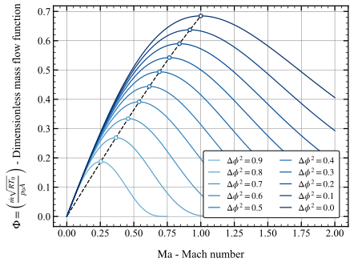
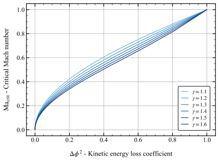

## Derivation of Critical Mach number for non-isentropic flow

**Assumptions**
- Fluid is modelled as a perfect gas
- Zero-dimensional flow in convergent nozzle
- Losses are modelled by a kinetic energy loss coefficient

**Energy balance**
The ratio of static to stagnation temperature can be related with the Mach number for both isentropic and non-isentropic flow:
$$
\begin{aligned}
& h_{0}=h+\frac{1}{2} v^{2} \\
& T_{0}=T+\frac{1}{2 c_{p}} v^{2} \\
& \left(\frac{T_{0}}{T}\right)=1+\left(\frac{\gamma-1}{2}\right) \cdot \frac{v^{2}}{\gamma R T} \quad \text{where} \quad a^2 = \gamma R T\\
& \left(\frac{T_{0}}{T}\right) =1+\left(\frac{\gamma-1}{2}\right) \cdot\left(\frac{v}{a}\right)^{2} \quad \text{where} \quad \text{Ma} = v/a \\
& \left(\frac{T_{0}}{T}\right) =1+\left(\frac{\gamma-1}{2}\right) \mathrm{Ma}^{2} \\
& \hat{T}=\left(\frac{T}{T_{0}}\right)  =\left[1+\left(\frac{\gamma-1}{2}\right) \mathrm{Ma}^{2} \right]^{-1}
\end{aligned}
$$
Solving for the Mach number we obtain:
$$ \mathrm{Ma}^{2}  =\left(\frac{2}{\gamma-1}\right)\left(\frac{1}{\hat{T}}-1\right)$$

**Kinetic energy loss coefficient**
The definition of kinetic energy loss coefficient can be used to relate the ratio of isentropic to stagnation temperature to the ratio of static to stagnation temperatures:
$$
\begin{aligned}
& \eta =1 - \Delta \phi^{2}=\left(\frac{v}{v_{s}}\right)^{2}=\left(\frac{h_{0}-h}{h_{0}-h_{s}}\right)=\left(\frac{T_{0}-T}{T_{0}-T_{s}}\right) \\
& T_{s}=T_{0}-\frac{1}{\eta}\left(T_{0}-T\right) \\
& \left(\frac{T_{s}}{T_{0}}\right)=1-\frac{1}{\eta} \cdot(1-\hat{T})
\end{aligned}
$$

**Pressure relationship for isentropic flow**
The relation between pressure and temperature for the isentropic flow is given by Gibbs' relation:
$$
\begin{aligned}
& T \mathrm{d}s=d h- \frac{\mathrm{d}p}{\rho} \Rightarrow \mathrm{d}h_{s}=\frac{\mathrm{d}p}{\rho} \Rightarrow \left(\frac{\gamma R}{\gamma-1}\right) \mathrm{d} T_{s}=R T \frac{\mathrm{d}p}{p} \\
& \frac{d p}{p} = \left(\frac{\gamma}{\gamma-1}\right) \frac{d T}{T} \\
& \ln \left(\frac{p}{p_{0}}\right) = \left(\frac{\gamma}{\gamma-1}\right) \ln \left(\frac{T_{s}}{T_{0}}\right) \\
& \left(\frac{p}{p_{0}} \right)  = \left(\frac{T_{s}}{T_{0}}\right)^{\left(\frac{\gamma}{\gamma-1}\right)}
\end{aligned}
$$

Inserting the expression for the ratio of isentropic and stagnation temperatures we obtain a relation for the pressure ration in non-isentropic flow:
$$
\left(\frac{p}{p_{0}}\right)=\left[1-\frac{1}{\eta}(1-\hat{T})\right]^{\left(\frac{\gamma}{\gamma-1}\right)}
$$

**Mass conservation equation**
The mass flow rate can be expressed as follows

$$
\begin{aligned}
& \dot{m} / A =\rho v = \left(\frac{p}{R T}\right) \, \sqrt{\gamma R T}  \, \mathrm{Ma}    \\
& \dot{m}/A = \frac{\sqrt{\gamma}  \, p_{0} \left(\frac{p}{p_{0}}\right) \, \mathrm{Ma} }{\sqrt{R T_{0}\left(\frac{T}{T_{0}}\right)}} \\
& \Phi=\left(\frac{\dot{m} \sqrt{R T_{0}}}{p_{0}  A}\right)=\frac{\sqrt{\gamma} \, \mathrm{Ma} \, (p/p_0)}{\sqrt{T / T_{0}}}
\end{aligned}
$$
Introducing the expressions for the Mach number and the static-to-stagnation pressure ratio as a function of the static-to-stagnation temperature ratio we obtain the following relation for the flow capacity factor:
$$
\Phi=\left(\frac{2 \gamma}{\gamma-1}\right)^{1 / 2} \cdot \frac{\sqrt{1-\hat{T}}}{\hat{T}}\left[1-\frac{1}{\eta}(1-\hat{T})\right]^{\frac{\gamma}{\gamma-1}}
$$

The condition of maximum mass flow (i.e., choking) when $\frac{\text{d} \Phi}{\text{d} \hat{T}}=0$

$$
\frac{\text{d} \Phi}{\text{d} \hat{T}}=\sqrt{\frac{2 \gamma}{\gamma-1}} \cdot\left[\frac{ \left(\frac{\hat{T}}{2}-1\right)}{\hat{T}^{2}(1-\hat{T})^{1 / 2}} \cdot\left(1+\frac{1}{\eta}(\hat{T}-1)\right)^{\frac{\gamma}{\gamma-1}} + \left(\frac{\gamma / \eta}{\gamma-1}\right)\left(\frac{(1-\hat{T})^{1 / 2}}{\hat{T}} \right)\left(1+\frac{1}{\eta}(\hat{T}-1)\right) =0\right.
$$
This equation is satisfied when
$$
(2 \alpha-1) \, \hat{T}^{2}+(3-\eta-2 \alpha) \, \hat{T}+2(\eta-1)=0  \quad \text {where} \quad \alpha=\frac{\gamma}{\gamma-1}
$$
Solving for the positive root of the second order equation we obtain:
$$\hat{T}_\text{crit}=\frac{(2 \alpha+\eta-3) + \sqrt{(\eta+1)^{2}+4 \alpha(1 + \alpha-3 \eta)}}{4 \alpha-2} $$
Therefore, the critical Mach number for non-isentropic flow is given by:
$$ \text{Ma}_\text{crit}^{2}=\left(\frac{2}{\gamma-1}\right)\left(\frac{1}{\hat{T}_\text{crit}}-1\right)=\left(\frac{2}{\gamma-1}\right)\left[\frac{4 \alpha-2}{(2 \alpha+\eta-3) + \sqrt{(1+\eta)^{2}+4 \alpha(1+\alpha-3 \eta)}} - 1\right]
$$

The variation of the dimensionless mass flow function against the Mach number at different values of the kinetic energy loss coefficient is illustrated below:

    

The variation of the critical Mach number against the kinetic energy loss coefficient for different values of the heat capacity ratio is illustrated below:

    

