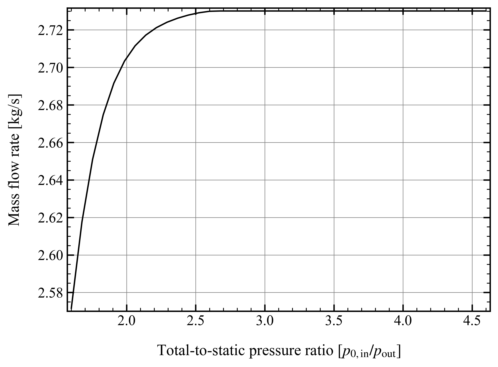
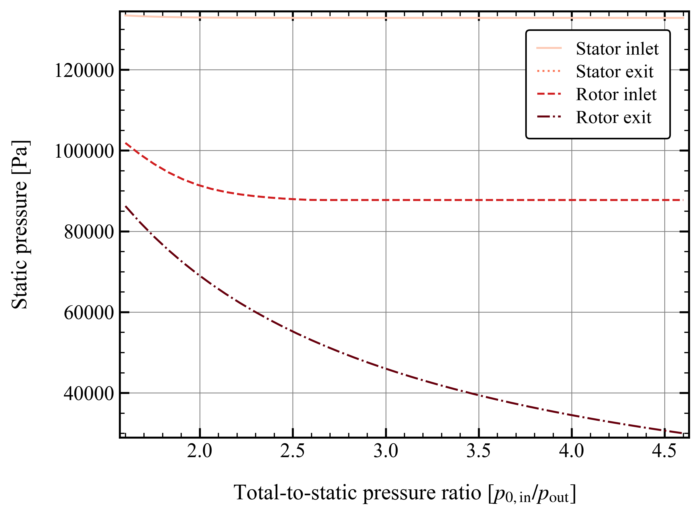
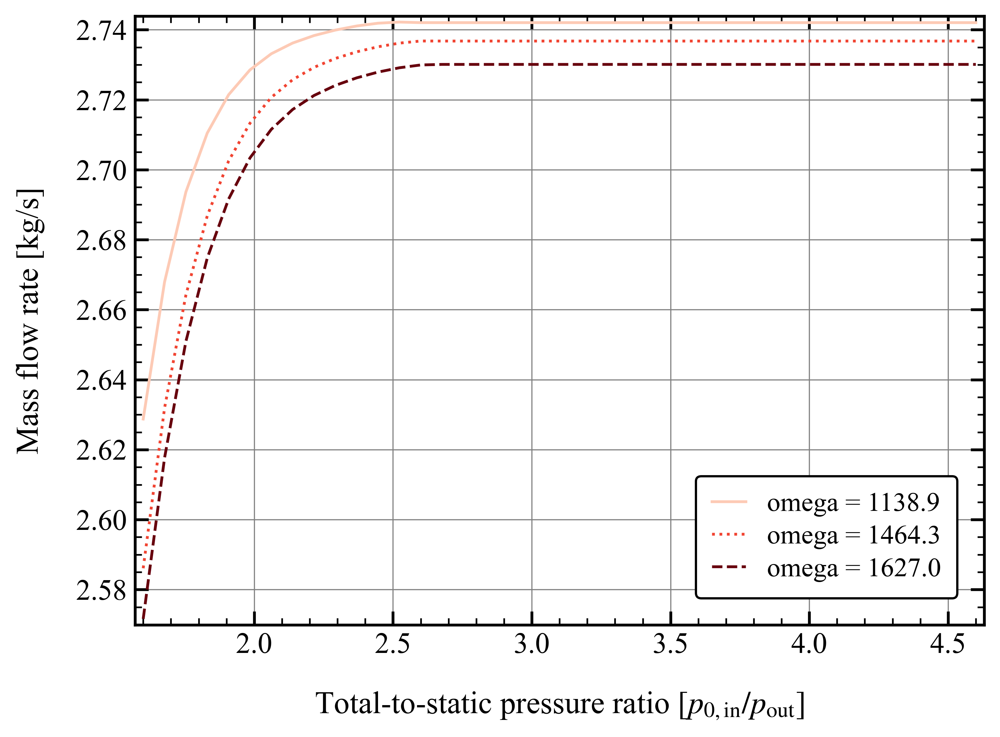
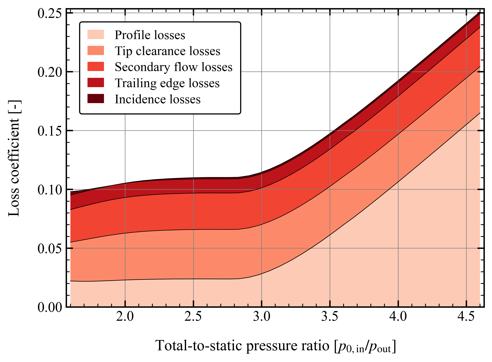

.. _performance_prediction:

Performance prediction
=====================================================

In this section, you will learn how to use TurboFlow to predict the performance of axial turbines. This includes setting up the configuration file, running the analysis, and interpreting the results.
Performance prediction is excecuted in three steps:

    1. Load configuration file.
    2. Define operating points where the turbine should be evaluated.
    3. Compute performance.

Illustrated by a code example:

.. code:: python

    import os
    import turboflow as tf
    

    CONFIG_FILE = os.path.abspath("my_configuration.yaml") # Get absolute path of configuration file
    config = tf.load_config(CONFIG_FILE) # Load configuration file 
    operation_points = config["operation_points"] # Define operating points
    solvers = tf.compute_performance(
        operation_points,
        config,
        export_results=True,
        stop_on_failure=True,
    ) # Evaluate turbine

This page describes the main functionalities and options available when simulating performance of axial turbines:

    - :ref:`configuration_setup`
    - :ref:`single_point`
    - :ref:`set_of_points`
    - :ref:`performance_map`
    - :ref:`options`
    - :ref:`plotting`

.. _configuration_setup:

Configuration setup
--------------------
The configuration must be setup in a yaml file, where certain sections are required, while others are optional, meaning that a default value is provided. In the example below, the 
full configuration for performance prediction is provided, where the required parts are marked with `# required` and the optional parts are marked with `# optional`. Note that 
to simulate performance across a perfomance map, the `performance_map` section is also required. 

In summary, these section are required:

    - `turbomachinery` : specifies the turbomachinery configuration.
    - `geometry`: all necessary geometrical variables.
    - `operation_points`: operational points at which the turbine should be evaluated.

while the rest is optional. Here is an example of how the confiugration file could look for a one-stage axial turbine:

.. code-block:: python

    turbomachinery: axial_turbine # Required
    operation_points: # Required
        fluid_name: air # Required
        T0_in: 295.6 # Required
        p0_in: 13.8e4 # Required
        p_out : 13.8e4/2.298 # Required
        omega: 1627 # Required
        alpha_in: 0 # Required

    simulation_options: # Optional
        deviation_model : aungier  # Optional
        choking_criterion : critical_mach_number # Optional
        rel_step_fd: 1e-4  # Optional
        loss_model:  # Optional
            model: benner  # Optional
            loss_coefficient: stagnation_pressure  # Optional
            inlet_displacement_thickness_height_ratio: 0.011  # Optional
            tuning_factors:  # Optional
                profile: 1.00  # Optional
                incidence: 1.00  # Optional
                secondary: 1.00  # Optional
                trailing: 1.00  # Optional
                clearance: 1.00  # Optional
    
    performance_analysis : # Optional
        performance_map: # Required if simulating performance across performance map
            fluid_name: air 
            T0_in: 295.6
            p0_in: 13.8e4
            p_out: 13.8e4/np.linspace(1.6, 4.5, 40)
            omega: 1627 
            alpha_in: 0 
        solver_options: # Optional
            method: hybr  # Optional
            tolerance: 1e-8  # Optional
            max_iterations: 100  # Optional
            derivative_method: "2-point"  # Optional
            derivative_abs_step: 1e-6  # Optional
            print_convergence: True # Optional
            plot_convergence: False # Optional
        initial_guess :
            efficiency_tt : [0.9, 0.8] 
            efficiency_ke : [0.2, 0.1]
            ma_1 : [0.8, 0.8]
            ma_2 : [0.8, 0.8]

    geometry: # Required
        cascade_type: ["stator", "rotor"] # Required
        radius_hub_in: [0.084785, 0.084785] # Required
        radius_hub_out: [0.084785, 0.081875] # Required
        radius_tip_in: [0.118415, 0.118415] # Required
        radius_tip_out: [0.118415, 0.121325] # Required
        pitch: [1.8294e-2, 1.524e-2] # Required
        chord: [2.616e-2, 2.606e-2] # Required
        stagger_angle: [+43.03, -31.05] # Required
        opening: [0.747503242e-2, 0.735223377e-2] # Required
        leading_edge_angle : [0.00, 29.60] # Required
        leading_edge_wedge_angle : [50.00, 50.00] # Required
        leading_edge_diameter : [2*0.127e-2, 2*0.081e-2] # Required
        trailing_edge_thickness : [0.050e-2, 0.050e-2] # Required
        maximum_thickness : [0.505e-2, 0.447e-2] # Required
        tip_clearance: [0.00, 0.030e-2] # Required
        throat_location_fraction: [1, 1] # Required

  
To load the configuration file, the absolute path must be provided to `turboflow.load_config`:

.. code-block:: python
    
    import os
    import turboflow as tf
    

    CONFIG_FILE = os.path.abspath("my_configuration.yaml") # Get absolute path of the configuration file
    config = tf.load_config(CONFIG_FILE) # Load configuration file 

.. note::

    The only current available option for turbomachinery is `axial_turbine`.

.. _single_point:

Compute performance at a single point
--------------------------------------
To perform single-point performance prediction, the `operation_points` section in the configuration file should be defined in the following way:

.. code-block:: python

    operation_points: 
        fluid_name: air
        T0_in: 295.6
        p0_in: 13.8e4
        p_out : 13.8e4/2.0
        omega: 1627
        alpha_in: 0

After loading the configuration file, the operation point is extracted from the configuration file, and provided to `turboflow.compute_performance`:

.. code:: python

    import os
    import turboflow as tf
    

    CONFIG_FILE = os.path.abspath("my_configuration.yaml")
    config = tf.load_config(CONFIG_FILE) # Load configuration file
    operation_points = config["operation_points"] # Extract operation point
    solvers = tf.compute_performance(
        operation_points,
        config,
        export_results=True,
        stop_on_failure=True,
    ) # Compute performance at operation point

.. _set_of_points:

Compute performance at a set of points 
-----------------------------------------
To perform performance prediction at a set of operation points, the `operation_points` section in the configuration file should be a list of operating points:

.. code-block:: python

    operation_points: 
        - fluid_name: air # First point
          T0_in: 295.6
          p0_in: 13.8e4
          p_out : 13.8e4/2.0
          omega: 1627
          alpha_in: 0
        - fluid_name: air # Second point
          T0_in: 295.6
          p0_in: 13.8e4
          p_out : 13.8e4/3.0
          omega: 1627
          alpha_in: 0

After loading the configuration file, the operation points are extracted from the configuration file, and provided to `turboflow.compute_performance`:

.. code:: python

    import os
    import turboflow as tf
    

    CONFIG_FILE = os.path.abspath("my_configuration.yaml")
    config = tf.load_config(CONFIG_FILE) # Load configuration file
    operation_points = config["operation_points"] # Extract operation points
    solvers = tf.compute_performance(
        operation_points,
        config,
        export_results=True,
        stop_on_failure=True,
    ) # Compute performance at operation points

.. _performance_map:

Compute performance across a performance map
---------------------------------------------

To perform performance prediction across a performance map, a `perfomance_map` section must be defined within the `performance_analysis` section:

.. code-block:: python

  performance_analysis :
    performance_map:
        fluid_name: air 
        T0_in: 295.6
        p0_in: 13.8e4
        p_out: 13.8e4/np.linspace(1.6, 4.5, 40)
        omega: 1627*np.array([0.9, 1.0, 1.1])
        alpha_in: 0 

The performance map is defined by setting either a value or a range for each boundary condition. The perfomance map is constructed by generating a list
of every combination of the given values/ranges. In the example above, the performance will be simulated for a total-to-static pressure ratio between 1.6 and 4.5 
at 90%, 100% and 110% of the design angular speed (`omega` = 1627).

After loading the configuration file, the performance map is extracted from the configuration file, and provided to `turboflow.compute_performance`:

.. code-block:: python

    import os
    import turboflow as tf
    

    CONFIG_FILE = os.path.abspath("my_configuration.yaml")
    config = tf.load_config(CONFIG_FILE) # Load configuration file
    operation_points = config["performance_analysis"]["performance_map"] # Extract perfomance map
    solvers = tf.compute_performance(
        operation_points,
        config,
        export_results=True,
        stop_on_failure=True,
    ) # Compute performance at operation points

.. _options:

Export results
---------------------------------------
When calling `turboflow.compute_performance()`, there are some keyword arguments available:

.. code-block:: python

    solvers = tf.compute_performance(
        operation_points,
        config,
        export_results=True,
        out_dir = "output",
        out_filename = None,
        stop_on_failure=False,
    ) 

If **export_results** is set to True, the simulation data is exported as an Excel file. The file is saved either to a 
specified directory (**out_dir**) or to the default directory “output”. The default filename (**out_filename**) is `performance_analysis_{current_time}`, 
where current_time is a string formatted as `{year}{month}{day}{hour}{minute}_{second}`.

The **stop_on_failure** breaks the analysis if one of the operation points fails to converge. 

.. _plotting:

Plotting results
------------------

Plotting functions are provided to graphically illustrate the simulated data. It supports various types of plots, including:

    - :ref:`single_line`, e.g. mass flow rate as a function of pressure ratio
    - :ref:`plot_several_lines`, e.g. mass flow rate as a function of pressure ratio at sifferent rotational speed
    - :ref:`stacked_plots`, e.g. stacked loss coefficients as a function of pressure ratio
    - :ref:`plot_velocity_triangles_PA`
    - :ref:`plot_axial_radial_plane_PA`

The first three types are made by loading the Excel file with the simulated data, and specify the x and y parameter in the plot (`x_key` and `y_key`):

.. code-block:: python

    import turboflow as tf
    import matplotlib.pyplot as plt

    filename = "output/performance_analysis_2024-01-01_01-01-01.xlsx"
    data = tf.plot_functions.load_data(filename) # Load results data

    fig1, ax1 = tf.plot_functions.plot_lines(
        data, # datset  
        x_key="PR_ts", # x-axis key
        y_keys=["mass_flow_rate"], # y-axis key
        xlabel="Total-to-static pressure ratio", # axis x-label
        ylabel="Mass flow rate [kg/s]", # axis y-label
        title="Turbine mass flow rate", # axis title
        filename="mass_flow_rate", # filename if figure should be saved
        outdir="figures", # output directory if figure should be saved
        save_figs=True,
    )

    plt.show()

The subsequent subsections gives a more detailed description of how to setup up the various plots. 

.. _single_line:

Plot single line
^^^^^^^^^^^^^^^^^^

To plot a single line, simply specify the list `y_keys` with one key:

.. code-block:: python

    import turboflow as tf
    import matplotlib.pyplot as plt

    filename = "output/performance_analysis_2024-01-01_01-01-01.xlsx"
    data = tf.plot_functions.load_data(filename) # Load results data

    fig1, ax1 = tf.plot_functions.plot_lines(
        data, # datset  
        x_key="PR_ts", # x-axis key
        y_keys=["mass_flow_rate"], # y-axis key
        xlabel="Total-to-static pressure ratio", # axis x-label
        ylabel="Mass flow rate [kg/s]", # axis y-label
        title="Turbine mass flow rate", # axis title
        filename="mass_flow_rate", # filename if figure should be saved
        outdir="figures", # output directory if figure should be saved
        save_figs=True,
    )

    plt.show()

Note that if the excel file contain a whole performance map (e.g. a range of pressure ratios and
angular speed), it is convenient to filter out a subset of this file (e.g. results at one specific angular speed). Here is an example, where 
the data is filtered based on a specific angular speed:

.. code-block:: python

    import turboflow as tf
    import matplotlib.pyplot as plt

    filename = "output/performance_analysis_2024-01-01_01-01-01.xlsx"
    data = tf.plot_functions.load_data(filename) # Load results data

    # Plot mass flow rate
    subsets = ["omega", 1627]
    fig1, ax1 = tf.plot_functions.plot_lines(
        data,
        x_key="PR_ts",
        y_keys=["mass_flow_rate"],
        subsets=subsets,
        xlabel="Total-to-static pressure ratio [$p_{0, \mathrm{in}}/p_\mathrm{out}$]",
        ylabel="Mass flow rate [kg/s]",
        colors='k',
        filename = 'design_speed_mass_flow_rate',
        outdir = "figures",
        save_figs=True,
    )

    plt.show()

`subsets` is used to filter a subset of the original dataset. It is constructed as a list, where the first element is 
a string that specifies the parameter you want to use to filter the data. The subsequent elements are the values of the selected
parameter that you want to include in your subset. 

The example above would give the following figure:

.. _plot_several_lines:

Plot several lines
^^^^^^^^^^^^^^^^^^^

To plot several lines, To plot a single line, simply specify the list `y_keys` with several keys:

.. code-block:: python

    import turboflow as tf
    import matplotlib.pyplot as plt

    filename = "output/performance_analysis_2024-01-01_01-01-01.xlsx"
    data = tf.plot_functions.load_data(filename) # Load results data

    # Plot mass flow rate
    subset = ["omega", 1627] 
    labels = ["Stator inlet", "Stator exit", "Rotor inlet", "Rotor exit"]
    fig1, ax1 = tf.plot_functions.plot_lines(
        data,
        x_key="PR_ts",
        y_keys=["p_1", "p_2", "p_3", "p_4"],
        subsets = subset,
        xlabel="Total-to-static pressure ratio [$p_{0, \mathrm{in}}/p_\mathrm{out}$]",
        ylabel="Static pressure [Pa]",
        linestyles=["-", ":", "--", "-."],
        color_map='Reds',
        labels = labels,
        filename='static_pressure',
        outdir = "figures",
        save_figs=True,
    )

    plt.show()

This example would give the following figure:

Similarly for the single point line, a subset can be defined. However, you can define several subsets, by specifying more 
values for the selected parameter. In this example, the mass flow 
rate is plotted as a function of total-to-static pressure ratio, at different subsets of angular speed:

.. code-block:: python

    import turboflow as tf
    import matplotlib.pyplot as plt
    import numpy as np

    filename = "output/performance_analysis_2024-01-01_01-01-01.xlsx"
    data = tf.plot_functions.load_data(filename) # Load results data

    # Plot mass flow rate
    subsets = ["omega"] + list(np.array([0.7, 0.9, 1])*1627)
    fig1, ax1 = tf.plot_functions.plot_lines(
        data,
        x_key="PR_ts",
        y_keys=["mass_flow_rate"],
        subsets=subsets,
        xlabel="Total-to-static pressure ratio [$p_{0, \mathrm{in}}/p_\mathrm{out}$]",
        ylabel="Mass flow rate [kg/s]",
        linestyles=["-", ":", "--"],
        color_map='Reds',
        filename = 'mass_flow_rate',
        outdir = "figures",
        save_figs=True,
    )

    plt.show()

resulting in this figure:

.. _stacked_plots:

Stacked plots
^^^^^^^^^^^^^^

Stacked plots can be convenient to illustrate the different loss coefficients at different operating points. Stacked plots
are made by specifying `stack = True`

.. code-block:: python

    import turboflow as tf
    import matplotlib.pyplot as plt

    filename = "output/performance_analysis_2024-01-01_01-01-01.xlsx"
    data = tf.plot_functions.load_data(filename) # Load results data

    # Plot mass flow rate
    subset = ["omega"] + [1627]
    labels = ["Profile losses", "Tip clearance losses", "Secondary flow losses", "Trailing edge losses", "Incidence losses"]
    fig1, ax1 = tf.plot_functions.plot_lines(
        data,
        x_key="PR_ts",
        y_keys=[
            "loss_profile_4",
            "loss_clearance_4",
            "loss_secondary_4",
            "loss_trailing_4",
            "loss_incidence_4",
        ],
        subsets = subset,
        xlabel="Total-to-static pressure ratio [$p_{0, \mathrm{in}}/p_\mathrm{out}$]",
        ylabel="Loss coefficient [-]", 
        color_map='Reds',
        labels = labels,
        stack=True,
        filename="loss_coefficients",
        outdir="figures",
        save_figs = True,
    )

    plt.show()

This would result in this figure:

.. _plot_velocity_triangles_PA:

Plot velocity triangles
^^^^^^^^^^^^^^^^^^^^^^^^^

This function plots the velocity triangles of an axial-turbine for a certain operation point. The plot is initialized by providing a solver object:

.. code-block:: python

    import os
    import turboflow as tf
    
    # Perform analysis
    CONFIG_FILE = os.path.abspath("my_configuration.yaml") # Get absolute path of the configuration file
    config = tf.load_config(CONFIG_FILE) # Load configuration file 
    solvers = tf.compute_performance(
        operation_points,
        config,
    )
    
    # PLot velocity triangles
    fig, ax = tf.plot_functions.plot_axial_radial_plane(solvers[0].problem.geometry)

Here is an example of how the velocity triangle plots looks:

.. image:: ../images/plot_velocity_triangles.png
    :scale: 15%

.. _plot_axial_radial_plane_PA:

Plot axial-radial plane
^^^^^^^^^^^^^^^^^^^^^^^^

This function plots the geometry of an axial-turbine in the axial-radial plane. The plot is initialized by providing a solver object:

.. code-block:: python

    import os
    import turboflow as tf
    
    # Perform analysis
    CONFIG_FILE = os.path.abspath("my_configuration.yaml") # Get absolute path of the configuration file
    config = tf.load_config(CONFIG_FILE) # Load configuration file 
    solvers = tf.compute_performance(
        operation_points,
        config,
    )
    
    # Plot geometry in the axial-radial plane
    fig, ax = tf.plot_functions.plot_velocity_triangles_planes(solvers[0].problem.results["plane"])

Here is an example of how the plot look:

.. image:: ../images/plot_axial_radial_plane.png
    :scale: 15%
